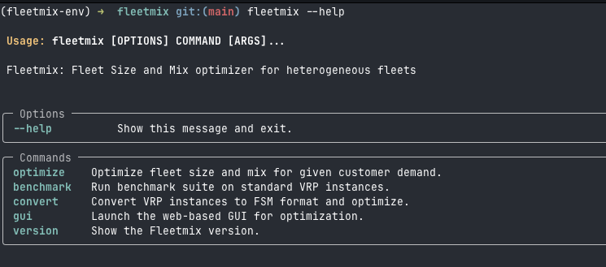
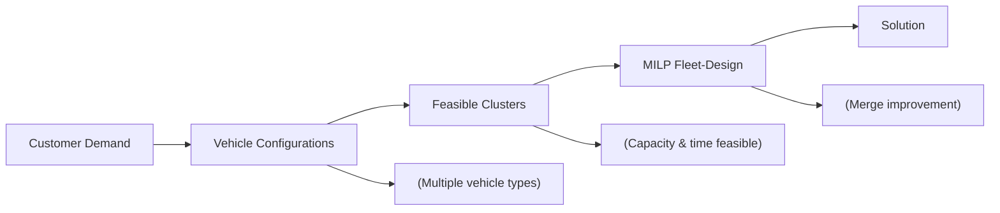

# 🚚 **fleetmix** — *Fleet Size & Mix Optimizer for Multi‑Compartment Fleets*

[](https://pypi.org/project/fleetmix/)
[](https://github.com/ekohan/fleetmix/actions)
[](LICENSE)
[](https://codecov.io/gh/ekohan/fleetmix)
<!-- TODO: publish PyPI -->


*Written for transparent research, hardened for production use.*

Fast, reproducible tooling for **multi‑compartment vehicle fleet design** in urban food distribution.
This repository supports our paper *Designing Multi‑Compartment Last‑Mile Vehicle Fleets: An Open‑Source Matheuristic* and provides a production-ready library for practitioners.

---

<!-- TODO: make GIF Demo -->

<p align="center">
  
  <br><em>(interactive demo – coming soon)</em>
</p>

---

## ✨ Why FleetMix?

* ⚡ **Scales** — >1,000 customers solved in seconds via a *cluster‑first → MILP‑second* matheuristic
* 🧩 **Extensible** — pluggable clustering engines, route‑time estimators, and solver back‑ends  
* 🔄 **Reproducible** — every experiment in the journal article re‑runs with one script
* 🖥️ **User‑friendly** — clean CLI, idiomatic Python API, and a lightweight web GUI
* 📐 **Spec-driven** — comprehensive module specifications connecting paper to code

---

## 🗺️ Table of Contents

1. [Installation](#installation)
2. [Quick Start](#quick-start)
3. [📐 Specifications & Documentation](#-specifications--documentation) ⭐
4. [Matheuristic Overview](#matheuristic-overview)
5. [Command‑Line Usage](#command-line-usage)
6. [Python API](#python-api)
7. [Configuration](#configuration)
8. [Composability & Extensibility](#composability--extensibility)
9. [Benchmarking Suite](#benchmarking-suite)
10. [Repository Layout](#repository-layout)
11. [Paper ↔ Code Map](#paper-↔-code-map)
12. [Contributing](#contributing)
13. [Citation](#citation)
14. [License](#license)

---

## ⚙️ Installation

### From PyPI *(coming soon)*

```bash
uv pip install fleetmix
```

### From Source *(development)*

```bash
# Clone and set up environment
git clone https://github.com/ekohan/fleetmix.git && cd fleetmix

# Install uv (if needed)
curl -LsSf https://astral.sh/uv/install.sh | sh
source "$HOME/.local/bin/env"

# Create virtual environment and install all extras
uv venv fleetmix-env
source fleetmix-env/bin/activate
uv sync --all-extras
```

Prefer `uv run <command>` for tooling, for example `uv run pytest -q`.

---

## 🚀 Quick Start

### Command‑Line Interface

```bash
# Run optimization on customer demand data
fleetmix optimize --demand customers.csv --config fleet.yaml

# Run the full MCVRP benchmark suite
fleetmix benchmark mcvrp

# Convert VRP instance to FSM format
fleetmix convert --type cvrp --instance X-n101-k25 --benchmark-type split

# Check version
fleetmix version
```

### Python API

```python
import fleetmix as fm

customers_df = ...  # build a DataFrame
solution = fm.optimize(demand=customers_df, config="config.yaml")
```

Retrieve metrics via `solution[...]` keys (see docstring for full schema).

### Web Interface

```bash
# Launch web interface
fleetmix gui

# Or specify a custom port
fleetmix gui --port 8080
```

The GUI provides:

* 📥 Drag‑and‑drop CSV upload
* 🎛️ Interactive parameter tweaking (including allowed goods per vehicle and split-stop configuration)
* 🔎 Real‑time optimization progress
* 🗺️ Map‑based visual results
* 📊 Excel/JSON export

---

## 📐 Specifications & Documentation

FleetMix is a **spec-driven codebase**: each module has detailed specifications connecting the paper's mathematical formulations to the implementation.

### For Researchers

| Document | Purpose |
|----------|---------|
| **[docs/ARCHITECTURE.md](docs/ARCHITECTURE.md)** | System overview and module interactions |
| **[docs/mapping.md](docs/mapping.md)** | Complete paper section ↔ code cross-reference |
| **[docs/specs/](docs/specs/)** | Detailed module specifications with math formulations |
| **[docs/REPRODUCIBILITY.md](docs/REPRODUCIBILITY.md)** | Reproduce all paper experiments |

### For Practitioners

| Document | Purpose |
|----------|---------|
| **[docs/quickstart.md](docs/quickstart.md)** | Get started in 5 minutes |
| **[docs/USER_GUIDE.md](docs/USER_GUIDE.md)** | Complete end-to-end workflow guide |
| **[docs/specs/configuration.md](docs/specs/configuration.md)** | All parameters explained |
| **[docs/specs/protocols.md](docs/specs/protocols.md)** | Plugin development guide |

### Module Specifications

Each phase of the matheuristic has a comprehensive specification:

1. **[Vehicle Configurations](docs/specs/vehicle_configurations.md)** (Paper §4.1) — Generating $2^{|M|}-1$ configurations per vehicle type
2. **[Clustering](docs/specs/clustering.md)** (Paper §4.2) — Feasible cluster generation with capacity and route time constraints
3. **[Route Time Estimation](docs/specs/route_time_estimation.md)** (Paper §4.2) — BHH continuous approximation vs. TSP solver
4. **[Optimization](docs/specs/optimization.md)** (Paper §4.3) — Fleet size and mix MILP formulation
5. **[Post-Optimization](docs/specs/post_optimization.md)** (Paper §4.4) — Iterative improvement phase
6. **[Pipeline](docs/specs/pipeline.md)** (Paper §4) — End-to-end orchestration

Supporting specs: **[Data Model](docs/specs/data_model.md)** | **[Configuration](docs/specs/configuration.md)** | **[Protocols](docs/specs/protocols.md)**

**💡 Tip**: Start with [docs/README.md](docs/README.md) for a guided tour of the documentation.

---

## 🏗️ Matheuristic Overview


```mermaid
graph LR
    A["Customer Demand"] --> B["Vehicle Configurations"]
    B --> C["Feasible Clusters"]
    C --> D["MILP Fleet-Design"]
    D --> E["Solution"]
    B --> F["(Multiple vehicle types)"]
    C --> G["(Capacity & time feasible)"]
    D --> H["(Merge improvement)"]
```

*Full algorithmic details are in §4 of the paper.*

---

## 🔧 Command‑Line Usage

### `fleetmix optimize`

Run fleet optimization on customer demand data.

```bash
fleetmix optimize \
  --demand customers.csv \
  --config fleet.yaml \
  --output results/ \
  --format excel \
  --verbose
```

### `fleetmix benchmark`

Run the **full benchmark suites** shipped with Fleetmix (batch mode over all instances).

```bash
fleetmix benchmark mcvrp   # All MCVRP instances
fleetmix benchmark cvrp    # All CVRP instances
fleetmix benchmark case    # All case study instances
```

You can also specify a config file to use custom parameters:

```bash
fleetmix benchmark mcvrp --config custom_config.yaml
fleetmix benchmark case --config baseline_config.yaml --format excel
```

### `fleetmix convert`

Convert a **single** CVRP / MCVRP instance into FSM format, run optimisation, and export results.

```bash
fleetmix convert --type mcvrp --instance 10_3_3_3_\(01\)
```
# TODO: what?
> *Legacy direct‑script calls still work but show deprecation warnings.*

---

## 🐍 Python API

```python
import fleetmix as fm

customers_df = ...  # build a DataFrame
solution = fm.optimize(demand=customers_df, config="config.yaml")
```

Retrieve metrics via `solution[...]` keys (see docstring for full schema).

---

## ⚙️ Configuration

FleetMix uses YAML configuration files to define fleet composition, optimization parameters, and operational constraints.

### Vehicle-Specific Goods Capability

Vehicles can be configured to carry only specific subsets of goods, enabling realistic modeling of specialized fleets:

```yaml
vehicles:
  # Dry goods only truck
  DryTruck:
    capacity: 2700
    fixed_cost: 100
    avg_speed: 30
    service_time: 25
    max_route_time: 10
    allowed_goods: ["Dry"]  # Can only carry dry goods
  
  # Refrigerated truck for cold chain
  RefrigeratedTruck:
    capacity: 3300
    fixed_cost: 175
    avg_speed: 30
    service_time: 25
    max_route_time: 10
    allowed_goods: ["Chilled", "Frozen"]  # No dry goods capability
  
  # Multi-temperature truck (no allowed_goods = can carry all goods)
  MultiTempTruck:
    capacity: 4500
    fixed_cost: 225
    avg_speed: 30
    service_time: 25
    max_route_time: 10
    # No allowed_goods specified - can carry all goods

goods:
  - Dry
  - Chilled
  - Frozen
```

**Key features:**
- If `allowed_goods` is not specified, the vehicle can carry all goods (backward compatible)
- If specified, must be a non-empty subset of the global `goods` list
- Automatically generates only feasible compartment combinations
- Optimization respects these constraints when assigning customers to vehicles

See `src/fleetmix/config/example_allowed_goods_config.yaml` for a complete example.

---

## 🧩 Composability & Extensibility

FleetMix uses a **Protocol-based plugin architecture** that makes it easy to add custom implementations for core components.

### Adding a Custom Clustering Algorithm

```python
from fleetmix.registry import register_clusterer
from fleetmix.interfaces import Clusterer
import pandas as pd
from typing import List

@register_clusterer("my_custom_clustering")
class MyCustomClusterer:
    """Custom clustering implementation."""
    
    def fit(self, customers: pd.DataFrame, *, context, n_clusters: int) -> List[int]:
        """Implement your clustering logic here."""
        # Your custom clustering algorithm
        # Must return a list of cluster labels (integers)
        labels = your_clustering_logic(customers, n_clusters)
        return labels

# Now use it in your config.yaml:
# clustering:
#   method: my_custom_clustering
```

The plugin system supports:
- **Clustering algorithms**: K-means, K-medoids, Agglomerative, Gaussian Mixture, or your own
- **Route time estimators**: BHH, TSP-based, or custom (e.g., with traffic data)
- **Solvers**: Gurobi, CBC, or any PuLP-compatible solver

> **Tip:** A plugin becomes available as soon as Python imports the module that holds the `@register_*` decorator.  
> Add something like `import my_package.my_plugin  # noqa: F401` near application start (before invoking `fleetmix.optimize(...)`) and FleetMix will automatically recognise the new plugin.

---

## 📊 Benchmarking Suite

Located under `src/fleetmix/benchmarking/`.

* **Converters** – `.vrp` / `.dat` → FSM tables
* **Parsers & Models** – light dataclasses for CVRP / MCVRP metadata
* **Solvers** – PyVRP wrapper providing single‑ & multi‑compartment baselines
* **Case Studies** – real-world demand patterns from food distribution
* **Scripts** – batch runners producing JSON/XLSX artifacts in `results/`

The suite includes three benchmark types:
- **CVRP**: Classic vehicle routing instances
- **MCVRP**: Multi-compartment vehicle routing instances  
- **Case**: Real-world food distribution demand patterns

Upper‑ and lower‑bound reference solutions are generated automatically for sanity checks.

---

## 🗂️ Repository Layout

```
src/fleetmix/
  api.py                # Python API facade
  app.py                # CLI (Typer)
  clustering/           # capacity & time‑feasible cluster generation
  optimization/         # MILP core (PuLP/Gurobi)
  post_optimization/    # merge‑phase heuristic
  benchmarking/         # datasets • converters • baselines
  gui.py                # lightweight web GUI
  utils/                # I/O, logging, etc.
docs/                   # code↔paper map • design notes
```

---

## 📝 Paper ↔ Code Map

FleetMix maintains complete traceability between the paper and code:

- **[docs/mapping.md](docs/mapping.md)**: Comprehensive cross-reference between paper sections, equations, algorithms, and code
- **[docs/ARCHITECTURE.md](docs/ARCHITECTURE.md)**: How modules connect to the matheuristic pipeline
- **Module specs**: Each links directly to relevant paper sections with mathematical formulations

**Example**: Paper §4.2 describes the BHH formula for route time estimation → see [docs/specs/route_time_estimation.md](docs/specs/route_time_estimation.md) for full specification → implemented in `src/fleetmix/utils/route_time.py`

---

## 🤝 Contributing

FleetMix welcomes contributions!

**Code contributions**:
1. Fork → feature branch → PR against **main**
2. `pytest -q --cov=src` **must** stay green
3. Follow *PEP‑8*, add type hints, and keep public APIs documented

**Documentation contributions**:
1. Follow [docs/templates/MODULE_SPEC_TEMPLATE.md](docs/templates/MODULE_SPEC_TEMPLATE.md) for new specs
2. Maintain bidirectional cross-references (paper ↔ code)
3. Include examples for both researchers and practitioners

Bug reports, feature requests, and questions via **[Issues](https://github.com/ekohan/fleetmix/issues)** are welcome.

---

## 📚 Citation

If using FleetMix in your research:

```bibtex
@article{Kohan2025FleetMix,
  author  = {Eric Kohan and Fabricio Torres and Victor Silva-Febre and J.C. Pina-Pardo},
  title   = {Designing Multi-Compartment Last-Mile Vehicle Fleets: An Open-Source Matheuristic},
  journal = {Computers and Industrial Engineering},
  year    = {2025},
  note    = {Submitted}
}
```

**Repository**: [github.com/ekohan/fleetmix](https://github.com/ekohan/fleetmix)  
**Paper Version**: Tagged as `paper-1.0.0`

---

## 🪪 License

`MIT` — free for academic & commercial use. See [`LICENSE`](LICENSE) for details.
