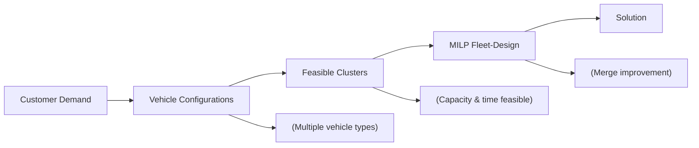

# 🚚 **fleetmix** — *Designing Multi‑Compartment Last‑Mile Vehicle Fleets: An Open‑Source Matheuristic*

[](https://pypi.org/project/fleetmix/)
[](https://github.com/ekohan/fleetmix/actions)
[](LICENSE)
[](https://codecov.io/gh/ekohan/fleetmix)

*Written for transparent research, hardened for production use.*

Fast, reproducible tooling for **multi‑compartment vehicle fleet design** in urban food distribution.
This repository supports our paper *Designing Multi‑Compartment Last‑Mile Vehicle Fleets: An Open‑Source Matheuristic* and provides a production-ready library for practitioners.

---

## ✨ Why FleetMix?

* ⚡ **Scales** — >1,000 customers solved in seconds via a *cluster‑first → MILP‑second* matheuristic
* 🧩 **Extensible** — pluggable clustering engines, route‑time estimators, and solver back‑ends  
* 🔄 **Reproducible** — every experiment in the journal article re‑runs with one script
* 🖥️ **User‑friendly** — clean CLI, idiomatic Python API, and a lightweight web GUI
* 📐 **Spec-driven** — comprehensive module specifications connecting paper to code

---

## 🗺️ Table of Contents

1. [Installation](#installation)
2. [Quick Start](#quick-start)
3. [📐 Specifications & Documentation](#-specifications--documentation) ⭐
4. [🔬 Reproducing Paper Experiments](#-reproducing-paper-experiments) ⭐
5. [Matheuristic Overview](#matheuristic-overview)
6. [Command‑Line Usage](#command-line-usage)
7. [Python API](#python-api)
8. [Configuration](#configuration)
9. [Composability & Extensibility](#composability--extensibility)
10. [Benchmarking Suite](#benchmarking-suite)
11. [Citation](#citation)
12. [License](#license)

---

## ⚙️ Installation

### From PyPI

```bash
uv pip install fleetmix
```

### From Source (development)

```bash
# Clone and set up environment
git clone https://github.com/ekohan/fleetmix.git && cd fleetmix

# Install uv (if needed)
curl -LsSf https://astral.sh/uv/install.sh | sh
source "$HOME/.local/bin/env"

# Create virtual environment and install all extras
uv venv fleetmix-env
source fleetmix-env/bin/activate
uv sync --all-extras --active

# Test
fleetmix --help
```

---

## 🚀 Quick Start

### Command‑Line Interface

```bash
# Run optimization on customer demand data
fleetmix optimize --demand customers.csv --config fleet.yaml

# Reproduce paper results
fleetmix reproduce-paper

# List all available commands
fleetmix --help
```

### Python API

```python
import fleetmix as fm

customers_df = ...  # build a DataFrame
solution = fm.optimize(demand=customers_df, config="config.yaml")
```

### Web Interface

```bash
fleetmix gui
```

The GUI provides drag‑and‑drop CSV upload, interactive parameter tweaking, real‑time optimization progress, and map‑based visual results.

---

## 📐 Specifications & Documentation

FleetMix is a **spec-driven codebase**: each module has detailed specifications connecting the paper's mathematical formulations to the implementation.

### For Researchers

| Document | Purpose |
|----------|---------|
| **[docs/ARCHITECTURE.md](docs/ARCHITECTURE.md)** | System overview and module interactions |
| **[docs/mapping.md](docs/mapping.md)** | Complete paper section ↔ code cross-reference |
| **[docs/specs/](docs/specs/)** | Detailed module specifications with math formulations |
| **[docs/REPRODUCIBILITY.md](docs/REPRODUCIBILITY.md)** | Reproduce all paper experiments |

### For Practitioners

| Document | Purpose |
|----------|---------|
| **[docs/quickstart.md](docs/quickstart.md)** | Get started in 5 minutes |
| **[docs/USER_GUIDE.md](docs/USER_GUIDE.md)** | Complete end-to-end workflow guide |
| **[docs/specs/configuration.md](docs/specs/configuration.md)** | All parameters explained |
| **[docs/specs/protocols.md](docs/specs/protocols.md)** | Plugin development guide |

---

## 🔬 Reproducing Paper Experiments

All experiments from the paper can be reproduced using the `fleetmix reproduce-paper` command suite:

```bash
# View available experiments
fleetmix reproduce-paper --help

# Experiment 1: MCVRP benchmark instances (Section: Effectiveness of the Matheuristic Approach)
fleetmix reproduce-paper mcvrp-instances

# Experiment 2: Sensitivity analysis (Section: Benefits of using MCVs)
fleetmix reproduce-paper sensitivity-analysis

# Experiment 3: Fleet composition analysis (Section: Impact of Cost Structure on Fleet Composition)
fleetmix reproduce-paper fleet-composition
```

**📖 Full documentation:** [docs/REPRODUCIBILITY.md](docs/REPRODUCIBILITY.md)

---

## 🏗️ Matheuristic Overview


```mermaid
graph LR
    A["Customer Demand"] --> B["Vehicle Configurations"]
    B --> C["Feasible Clusters"]
    C --> D["MILP Fleet-Design"]
    D --> E["Solution"]
    B --> F["(Multiple vehicle types)"]
    C --> G["(Capacity & time feasible)"]
    D --> H["(Merge improvement)"]
```

*Full algorithmic details are in §4 of the paper.*

---


## ⚙️ Configuration

FleetMix uses YAML configuration files to define fleet composition, optimization parameters, and operational constraints.

### Vehicle-Specific Goods Capability

Vehicles can be configured to carry only specific subsets of goods, enabling realistic modeling of specialized fleets:

```yaml
vehicles:
  # Dry goods only truck
  DryTruck:
    capacity: 2700
    fixed_cost: 100
    avg_speed: 30
    service_time: 25
    max_route_time: 10
    allowed_goods: ["Dry"]  # Can only carry dry goods
  
  # Refrigerated truck for cold chain
  RefrigeratedTruck:
    capacity: 3300
    fixed_cost: 175
    avg_speed: 30
    service_time: 25
    max_route_time: 10
    allowed_goods: ["Chilled", "Frozen"]  # No dry goods capability
  
  # Multi-product type truck (no allowed_goods = can carry all goods)
  MultiProductTruck:
    capacity: 4500
    fixed_cost: 225
    avg_speed: 30
    service_time: 25
    max_route_time: 10
    # No allowed_goods specified - can carry all goods

goods:
  - Dry
  - Chilled
  - Frozen
```

See `src/fleetmix/config/default_config.yaml` for a complete example.

---

## 🧩 Composability & Extensibility

FleetMix uses a **Protocol-based plugin architecture** (see `src/fleetmix/interfaces.py`) that makes it easy to add custom implementations for core components.

The plugin system supports:
- **Clustering algorithms**: K-means, K-medoids, Agglomerative, Gaussian Mixture, or your own
- **Route time estimators**: BHH, TSP-based, or custom (e.g., with traffic data)
- **Solvers**: Gurobi, CBC, or any PuLP-compatible solver

**See also:**
- **[docs/specs/protocols.md](docs/specs/protocols.md)** for detailed interface definitions
- **[`src/fleetmix_example_plugins/`](src/fleetmix_example_plugins/)** for working examples (`round_robin.py`, `straight_line.py`, `naive_solver.py`)


---

## 📊 Benchmarking Suite

Located under `src/fleetmix/benchmarking/`.

* **Converters** – `.vrp` / `.dat` → FSM tables
* **Solvers** – PyVRP wrapper providing single‑ & multi‑compartment baselines
* **Case Studies** – real-world demand patterns from food distribution

---

## 📚 Citation

If using FleetMix in your research:

```bibtex
@article{Kohan2025FleetMix,
  author  = {Eric Kohan and Fabricio Torres and Victor Silva-Febre and J.C. Pina-Pardo},
  title   = {Designing Multi-Compartment Last-Mile Vehicle Fleets: An Open-Source Matheuristic},
  journal = {Computers and Industrial Engineering},
  year    = {2025},
  note    = {Submitted}
}
```

**Repository**: [github.com/ekohan/fleetmix](https://github.com/ekohan/fleetmix)  

---

## 🪪 License

`MIT` — free for academic & commercial use. See [`LICENSE`](LICENSE) for details.
